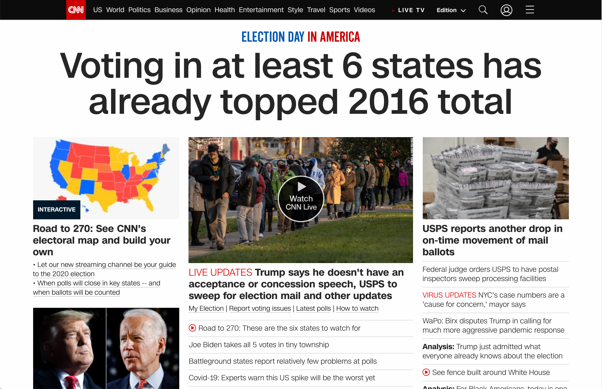

---

date: "2020-11-03"
layout: post
tags:
  - personal
---

(intentionally untitled, because what would I call it?)

I'm 25 years old at the time of this U.S. election. I hope it's the most "exciting" election of my lifetime.

By which I mean, I hope Americans have overwhelmingly voted for a change. I hope we voted so hard to defend immigrants, women, gay people, healthcare workers, laborers, children, Black people, and on and on.

For posterity's sake, I will link a few articles about the tumultuous Trump presidency.

- [Lest We Forget the Horrors: A Catalog of Trump’s Worst Cruelties, Collusions, Corruptions, and Crimes](https://www.mcsweeneys.net/articles/the-complete-listing-so-far-atrocities-1-963)
- [The Plot to Kidnap Me](https://www.theatlantic.com/ideas/archive/2020/10/plot-kidnap-me/616866/)
- [Trump’s Attempt to Obscure the Reality of the Coronavirus Pandemic Is Getting Comical](https://www.newyorker.com/news/our-columnists/trumps-attempt-to-obscure-the-reality-of-the-pandemic-is-getting-comical)

I continue to press on through the anxiety. I hope you are doing so too.

update 2:26 PM EST: Fucking doomsday headline

update 4:31 PM EST: lol. via [@jwestcottphoto](https://twitter.com/jwestcottphoto/status/1323713898680385536)
