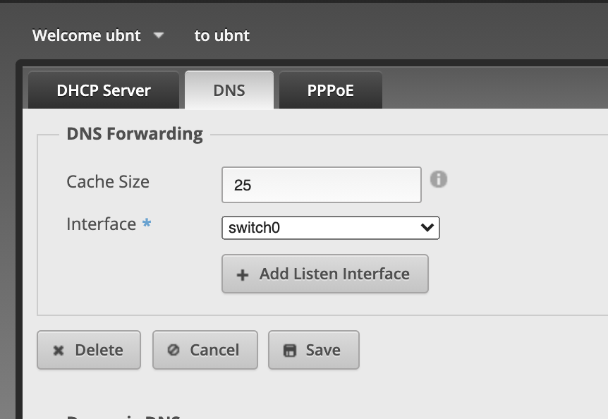

I had an interesting problem with my TP-Link Archer C1200 router. The internet light was lit up orange, and the router's web admin site said "no internet", even though all my clients were connected and accessing the internet at full speed. I also noticed that setting the time via NTP failed, as did checking for a firmware update.

I should note now that I have an Ubiquiti EdgeRouter X in between my Spectrum internet modem and the TP-Link box. The Archer is actually only performing as a WAP (wireless access point) (lol).

So here's the catch: when the Archer boots up, it expects to get DNS on its WAN port, just like it would if connected directly to the ISP's modem.

The ER-X must provide DNS and/or forward DNS requests to the TP-Link AP. If the Archer can't resolve names, it thinks it is offline.

So, make sure that the **DNS Forwarding** option is enabled on the ER-X. Here's what it looks like on the web ui:

In my case, the DNS is sent to directly to my ISP, Spectrum. Note that only the ER-X and Archer WAP use the ISP DNS. All other clients use my PiHole, pointed at Quad9.
